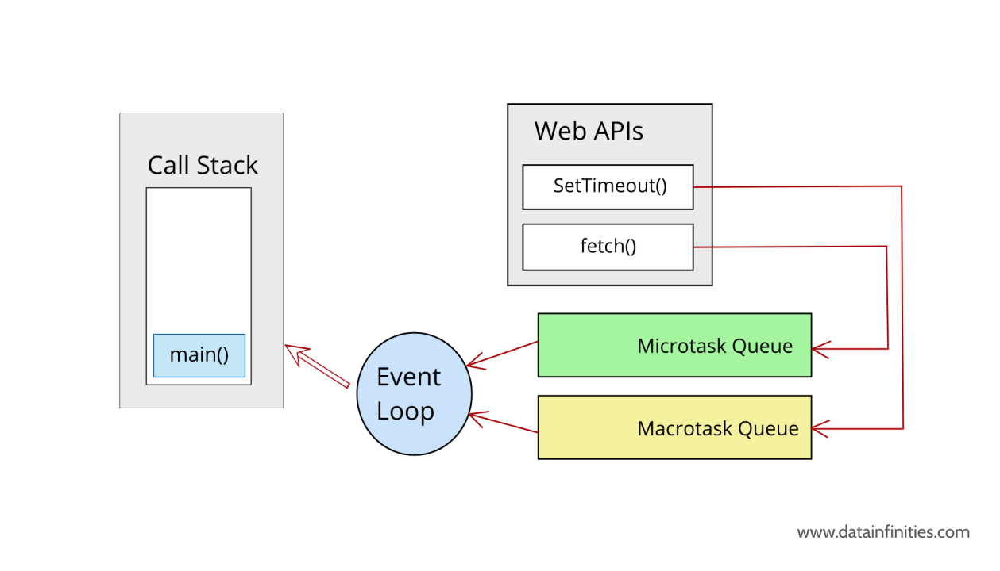

# JavaScript Event Loop - Complete Teaching Guide

<div align="center">

### 🚀 Master the JavaScript Event Loop | Complete Visual Teaching Guide

[](https://developer.mozilla.org/en-US/docs/Web/JavaScript)
[](https://nodejs.org/)

**Learn how JavaScript handles asynchronous operations with visual diagrams and real code examples**

📚 Perfect for: Students | Developers | Interview Preparation | Teaching Demos

</div>

---

---------------------------------------------------------
🎬 SLIDE 1 — Introduction: Why Learn the Event Loop?
---------------------------------------------------------
JavaScript is one of the most powerful languages today.
It runs inside every browser, handles user interaction, animations, timers, network calls, and much more.
But here is the interesting part:
👉 JavaScript can do only one thing at a time.
So how does it handle so many things without freezing?
That is the magic of the Event Loop —
the engine that makes JavaScript feel smooth, fast, and intelligent.
Today, I will teach it in a way that even a complete beginner will understand.


> **Visual Overview:** This diagram shows how JavaScript's Event Loop connects the Call Stack, Web APIs, and Callback Queue to handle asynchronous operations.


> **Browser Event Loop Architecture:** This diagram illustrates the complete JavaScript event loop architecture in the browser environment, showing how the JavaScript engine collaborates with Web APIs to manage asynchronous operations efficiently.
---------------------------------------------------------
🎬 SLIDE 2 — JavaScript Is Single-Threaded
---------------------------------------------------------
Let's imagine JavaScript as a person who performs tasks one by one.
They read one line of code
Finish it
Then move to the next line
JavaScript cannot do two tasks at the same time inside its main execution.
This is called:
💡 Single Threaded Execution
It sounds simple…
but becomes complex when we deal with tasks like timers or network calls.

---------------------------------------------------------
🎬 SLIDE 3 — The Problem: What If Something Takes Time?
---------------------------------------------------------
Imagine JavaScript encounters a very slow task:
A loop that runs 1 billion times
A 5-second timer
A network request waiting for data
If JavaScript waits here…
❌ The user cannot click
❌ UI gets stuck
❌ Website freezes
This is why we need a different system.
A system that allows JavaScript to continue working
while slow tasks are handled somewhere else.

---------------------------------------------------------
🎬 SLIDE 4 — The Secret Helpers Behind JavaScript: Web APIs
---------------------------------------------------------
JavaScript is not alone.
It lives inside a browser.
And the browser gives JavaScript superpowers.
These powers come from Web APIs:
setTimeout
setInterval
fetch
DOM events (click, scroll, input)
localStorage
When JS sees a slow task, it does something brilliant:
👉 It gives the task to the browser
👉 And JS continues running other code
👉 Browser completes the task and notifies JS later
This makes JavaScript non-blocking.

---------------------------------------------------------
🎬 SLIDE 5 — Call Stack: The Heart of JavaScript
---------------------------------------------------------
The Call Stack is a place where JavaScript actually executes code.
Think of it like a stack of plates:
When a function is called → it is placed on top
When finished → it is removed
JavaScript always works on the topmost plate.
If something heavy sits here,
everything else behind it must wait.

---------------------------------------------------------
🧪 CODE EXAMPLE — Normal Synchronous Flow
---------------------------------------------------------
```javascript
function a() {
  console.log("Inside A");
}

function b() {
  console.log("Inside B");
}

a();
b();
console.log("Done");
```

✔ Simple
✔ Sequential
✔ No waiting
✔ One thing at a time

---------------------------------------------------------
🎬 SLIDE 6 — Web APIs: Handling Slow Work for JavaScript
---------------------------------------------------------
When JS sees this:
```javascript
setTimeout(() => {
  console.log("Hey!");
}, 3000);
```

It does NOT wait for 3 seconds.
Instead:
Timer goes to Web API
Web API waits
JS continues running the next code
After 3 seconds, browser sends a message back to JS
But the message cannot interrupt JS directly…
So where does it go?

---------------------------------------------------------
🎬 SLIDE 7 — The Callback Queue
---------------------------------------------------------
Once the browser finishes tasks like:
setTimeout
setInterval
click events
It puts their callbacks into a waiting area called:
🟥 Callback Queue
(Also called the Macrotask Queue)
These tasks wait patiently for their turn.

---------------------------------------------------------
🎬 SLIDE 8 — The Microtask Queue (VIP Queue)
---------------------------------------------------------
Some tasks are more important.
Promise.then()
async/await
queueMicrotask()
These go into a special VIP queue called the:
🟩 Microtask Queue
JavaScript ALWAYS clears this queue first
because microtasks have higher priority.



> **Queue Priority:** Green shows the Microtask Queue (Promises) which always runs before the yellow Macrotask Queue (setTimeout, callbacks). The Event Loop checks microtasks first!

---------------------------------------------------------
🧪 CODE EXAMPLE — Microtasks vs Macrotasks
---------------------------------------------------------
```javascript
console.log("Start");

setTimeout(() => console.log("Timeout"), 0);

Promise.resolve().then(() => console.log("Promise"));

console.log("End");
```

Output:
```
Start
End
Promise
Timeout
```

✔ Promise → Microtask (VIP)
✔ Timeout → Macrotask (Normal)

---------------------------------------------------------
🎬 SLIDE 9 — The Event Loop
---------------------------------------------------------
Now comes the hero of the story:
🎯 Event Loop:
The Event Loop is one of the most important ideas in JavaScript.
If the Call Stack is the heart, then the Event Loop is the brain that decides when things should happen.

You can think of the Event Loop as a manager who constantly watches the system and makes decisions every single moment.

Here is how it works, in simple words:

🧠 1. The Event Loop keeps watching the Call Stack

It looks at the Call Stack again and again, asking:

“Is JavaScript busy right now, or is it free?”

If the Call Stack is busy running some code, the Event Loop patiently waits.

🧠 2. When JavaScript becomes free, it gives first priority to Microtasks

The Event Loop says:

“Before anything else, let me finish all the microtasks (Promises).
These are VIP tasks.”

So it runs every single Promise callback, one after another, until the microtask queue is completely empty.

This is why Promises run earlier than timeouts.

🧠 3. After microtasks, it runs ONE macrotask

When the microtask queue is empty, the Event Loop turns to the Callback Queue and says:

“Okay, now I can take one normal callback, like setTimeout or a click event.”

It will take only one macrotask at a time, run it completely, and then repeat the whole checking process again.

🧠 4. This cycle repeats over and over

This checking, deciding, and executing happens so fast that it seems magical —
but it’s just the Event Loop doing its job perfectly.

This is what keeps JavaScript:

smooth

fast

responsive

non-blocking

able to manage multiple tasks

even though it has only one thread

---------------------------------------------------------
🎬 SLIDE 10 — Why Promise Chains Run Faster
---------------------------------------------------------
```javascript
Promise.resolve()
  .then(() => console.log("C"))
  .then(() => console.log("D"));
```

Both C and D go into the microtask queue.
This means they run before any timer callback.
This is why:
```
A
E
C
D
B
```

makes total sense.

---------------------------------------------------------
🎬 SLIDE 11 — setTimeout(0) Is NOT Instant
---------------------------------------------------------
A timer with 0ms still goes to the callback queue.
So it must wait for:
✔ The call stack to empty
✔ Microtasks to complete
This is why it feels slower than expected.

---------------------------------------------------------
🎬 SLIDE 12 — Full Analogy: The Supermarket
---------------------------------------------------------
Imagine a supermarket:
👩‍💼 Cashier = JavaScript
🧑‍🔧 Workers = Web APIs
🟩 VIP line = Microtask Queue
🟥 Normal line = Callback Queue
🧑‍💼 Manager = Event Loop
The manager always says:
👉 "VIP customers first!"
This is EXACTLY how JavaScript works.

---------------------------------------------------------
🎬 SLIDE 13 — Final Summary (Crystal Clear)
---------------------------------------------------------
JavaScript runs one thing at a time
Browser handles slow tasks
Microtasks > Macrotasks
Event Loop manages what runs when
Promises run before timeouts
JavaScript becomes fast because of delegation


> **Complete Architecture:** This comprehensive diagram shows all components working together - Call Stack (yellow), Callback Queue (green onclick), Priority Queue (green Promises), WebAPIs (pink), and the Event Loop connecting everything. Notice how Promises have "Highest Priority"!

---------------------------------------------------------
🎬 SLIDE 14 — Final Practice Code
---------------------------------------------------------
```javascript
console.log(1);

setTimeout(() => console.log(2), 1000);

Promise.resolve().then(() => console.log(3));

console.log(4);
```

Ask your students:
👉 What will be the output?
Correct answer:
```
1
4
3
2
```

---

## 🎥 Visual Animations - Watch the Event Loop in Action!

---

Below are animated visualizations that demonstrate how JavaScript's Event Loop works in real-time. These animations will help you understand the flow of execution, asynchronous operations, and how different queues interact.

### 📹 Animation 1: Basic Event Loop Flow

<video src="https://github.com/yogeshmasaistudent/Event_loop-/raw/main/js1.mp4" autoplay loop muted playsinline width="100%" controls></video>

> **What You'll See:** This animation shows the basic flow of the Event Loop, demonstrating how the Call Stack, Web APIs, and Callback Queue work together.

---

### 📹 Animation 2: setTimeout Execution

<video src="https://github.com/yogeshmasaistudent/Event_loop-/raw/main/j6.mp4" autoplay loop muted playsinline width="100%" controls></video>

> **What You'll See:** Watch how setTimeout callbacks are handled by Web APIs and placed in the Callback Queue.

---

### 📹 Animation 3: Promise Microtask Queue

<video src="https://github.com/yogeshmasaistudent/Event_loop-/raw/main/js10.mp4" autoplay loop muted playsinline width="100%" controls></video>

> **What You'll See:** See how Promises are placed in the Microtask Queue and get priority over regular callbacks.

---

### 📹 Animation 4: Microtask vs Macrotask Priority

<video src="https://github.com/yogeshmasaistudent/Event_loop-/raw/main/js11.mp4" autoplay loop muted playsinline width="100%" controls></video>

> **What You'll See:** This animation demonstrates why Promises execute before setTimeout callbacks - the priority difference between queues.

---

### 📹 Animation 5: Complete Event Loop Cycle

<video src="https://github.com/yogeshmasaistudent/Event_loop-/raw/main/js12.mp4" autoplay loop muted playsinline width="100%" controls></video>

> **What You'll See:** A comprehensive visualization showing the entire Event Loop cycle with multiple asynchronous operations.

---

### 🎯 Key Takeaways from Animations:

✅ **Call Stack** executes code synchronously (one at a time)  
✅ **Web APIs** handle async operations (timers, fetch, DOM events)  
✅ **Microtask Queue** (Promises) has highest priority  
✅ **Callback Queue** (setTimeout, events) runs after microtasks  
✅ **Event Loop** coordinates everything perfectly

---

### 💡 Pro Tip:
Watch these animations multiple times while reviewing the code examples above. Visual learning combined with code execution will solidify your understanding of the Event Loop!

---

🎉 Your STYLE C Markdown Slide Deck Is Ready!
