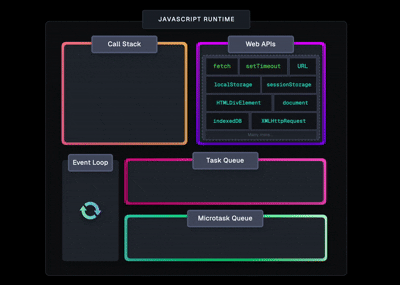
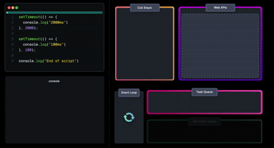

# JavaScript Event Loop - Complete Teaching Guide

<div align="center">

### 🚀 Master the JavaScript Event Loop | Step-by-Step Visual Journey

[](https://developer.mozilla.org/en-US/docs/Web/JavaScript) [](https://nodejs.org/)

**From Zero to Hero: Build Mind-Blowing Understanding of JavaScript's Secret Engine**

</div>

---

### 🎯 Welcome! Let's Start This Journey

Today, I'm going to teach you something **magical** about JavaScript.  
Something that makes websites fast, smooth, and responsive.  
Something that **every developer** must understand deeply.

**Are you ready? Let's begin!** 👇

---

## 🎬 The Big Question

**JavaScript is one of the most powerful languages today.**

It runs inside every browser, handles:

- ✨ User interactions (clicks, scrolls)
- 🎨 Animations
- ⏰ Timers
- 🌐 Network calls (fetching data)
- 📦 And much, much more...

### But here's the twist... 🤔

👉 **JavaScript can do only ONE thing at a time!**

Yes, you heard that right. JavaScript has only **one thread**.

So the question is:

> **"If JavaScript can do only one thing at a time,  
> how does it handle SO MANY things without freezing?"**

That's the magic of the **Event Loop** ⚡

---

<div align="center">
  
</div>

> **💬 What You See Here:**  
> This animation shows the complete event loop in action. Watch how tasks flow from the Call Stack to Web APIs, then to queues, and back. This continuous cycle is what makes JavaScript non-blocking!
> 
> **❓ Ask Your Students:** *"Can you identify the different parts moving in this animation? What do you think each colored section represents?"*

---

<div align="center">
  
</div>

> **💬 What You See Here:**  
> This is the basic flow showing how JavaScript handles synchronous code execution. Notice how each function call is added to the stack and removed once completed.
> 
> **❓ Discussion Point:** *"What happens if one function takes too long to execute?"*

---

## 🎬 JavaScript is Single-Threaded

Let me explain with a simple analogy:

Imagine JavaScript as **one person** working in a kitchen.  
This person can:

- 🥘 Prepare one dish at a time
- 📖 Read one recipe at a time
- 🔥 Cook one item at a time

This is called **Single-Threaded Execution**.

**❓ Question for Students:**  
*"Can anyone give me a real-world example where doing one thing at a time could be a problem?"*

---

### Let's See It In Action! 👀

```js
console.log("One!");
console.log("Two!");

function logThree() {
  console.log("Three!");
}

function logThreeAndFour() {
  logThree();
  console.log("Four!");
}

logThreeAndFour();

**Output:**
One!
Two!
Three!
Four!
```

> **💬 Explanation:**  
> *"Notice how everything runs in perfect order, one after another. This is the Call Stack doing its job. Each function is executed completely before moving to the next."*

---

<div align="center">
  
</div>

> **💬 What You See Here:**  
> This animation demonstrates how `setTimeout` works. The timer doesn't block JavaScript - it's handed off to the Web API, and JavaScript continues running other code.
> 
> **❓ Challenge Question:** *"If setTimeout has 0 milliseconds delay, will it execute immediately? Let's think about this..."*

---

<div align="center">
  
</div>

> **💬 What You See Here:**  
> This is the complete architecture diagram showing how the browser environment works with JavaScript. You can see the Call Stack, Web APIs, and both types of queues (Microtask and Macrotask).
> 
> **💡 Teaching Tip:** *Point to each component and explain: "The Call Stack is where code runs, Web APIs handle browser features, and queues hold callbacks waiting their turn."*

---

## 🎬 The Problem - What If Something Takes Time?

Now imagine JavaScript encounters a **slow task**:

❌ A loop that runs 1 billion times  
❌ A 5-second timer  
❌ A network request waiting for data

If JavaScript waits here...

😱 **The user cannot click**  
😱 **UI gets stuck**  
😱 **Website freezes**

**❓ Interactive Question:**  
*"Have you ever used a website that froze? What was your experience? That's blocking in action!"*

---

### Let's See It In Action! 👀

<div align="center">
  
</div>

> **💬 What You See Here:**  
> This shows how Promises use the Microtask Queue - a special VIP queue that gets priority over regular callbacks. Notice how Promise callbacks execute before setTimeout callbacks.
> 
> **❓ Prediction Question:** *"If we have both a Promise and a setTimeout with 0ms, which runs first? Why?"*

---

This is called **"Blocking"** - and it's **BAD**!

So we need a different system. A system that allows JavaScript to **continue working** while slow tasks are handled **somewhere else**.

### But where? 👇

---

## 🎬 The Secret Helpers Behind JavaScript: Web APIs

**JavaScript is not alone!**

It lives inside a **browser**. And the browser gives JavaScript **superpowers** 🦸

These superpowers are called **Web APIs**:

🌐 **setTimeout** - Set timers  
🌐 **setInterval** - Repeat tasks  
🌐 **fetch** - Get data from servers  
🌐 **DOM events** - Handle clicks, scrolls  
🌐 **localStorage** - Store data  
🌐 **Geolocation** - Get user location

<div align="center">
  
</div>

> **💬 What You See Here:**  
> This animation shows how Web APIs work independently from JavaScript. When you call setTimeout or fetch, the browser handles it while JavaScript keeps running!
> 
> **💡 Key Point to Emphasize:** *"Web APIs run OUTSIDE JavaScript. This is the secret to non-blocking behavior!"*

---

### Here's The Brilliant Part:

When JavaScript sees a slow task, it does something **clever**:

1️⃣ **Gives the task to the browser** (Web APIs)  
2️⃣ **Continues running other code**  
3️⃣ **Browser completes the task and notifies JavaScript later**

This makes JavaScript **non-blocking**! 🚀

---

## 🎬 Call Stack: The Heart of JavaScript

The **Call Stack** is where JavaScript actually **executes code**.

Think of it like a **stack of plates** 🍽️:

- When a function is called → it's placed **on top**
- When finished → it's **removed**
- JavaScript always works on the **topmost plate**

**❓ Visual Learning Question:**  
*"If I stack plates, can I remove the bottom one first? No! Same with the Call Stack - Last In, First Out (LIFO)!"*

---

### If something heavy sits here, everything else must **wait**

---

## 🎬 Web APIs: Handling Slow Work for JavaScript

When JS sees this:

```js
setTimeout(() => {
  console.log("Hey!");
}, 3000);
```

It does NOT wait for 3 seconds.

**Instead:**
1. Timer goes to **Web API**
2. Web API waits
3. JS continues running the next code

After 3 seconds, browser sends a message back to JS—  
But the message cannot interrupt JS directly…

**So where does it go?**

---

## 🎬 The Callback Queue (Task Queue)

Once the browser finishes tasks like:

- ⏰ setTimeout
- 🔁 setInterval
- 🖱️ Click events

It puts their **callbacks** into a waiting area called:

🟥 **Callback Queue** (also called **Macrotask Queue** or **Task Queue**)

These tasks wait patiently for their turn.

---

<div align="center">
  
</div>

> **💬 What You See Here:**  
> This demonstrates async/await, which is just syntactic sugar over Promises. See how the execution pauses at 'await' but doesn't block the entire program!
> 
> **💡 Teaching Moment:** *"Async/await makes asynchronous code look synchronous, but under the hood, it's still using Promises and the Microtask Queue."*

---

But there's another queue that's even **more important**! 👇

---

### The VIP Queue - Microtask Queue

Some tasks are **more important** and get **special treatment**:

🟩 **Promise.then()**  
🟩 **async/await**  
🟩 **queueMicrotask()**

These go into a **VIP queue** called:

🟩 **Microtask Queue**

JavaScript **ALWAYS** clears this queue **first** because microtasks have **highest priority**!

**❓ Critical Question:**  
*"Why do you think Promises get VIP treatment? Think about user experience..."*

---

## 🧪 CODE EXAMPLE — Microtasks vs Macrotasks

```js
console.log("Start");

setTimeout(() => {
  console.log("Timeout");
}, 0);

Promise.resolve().then(() => {
  console.log("Promise");
});

console.log("End");
```

**Output:**
```
Start
End
Promise
Timeout
```

✔ **Promise** → Microtask (VIP)  
✔ **Timeout** → Macrotask (Normal)

> **💬 Walkthrough This Example:**  
> 1. "Start" logs immediately (synchronous)
> 2. setTimeout goes to Web API, callback to Macrotask queue
> 3. Promise callback goes to Microtask queue
> 4. "End" logs immediately (synchronous)
> 5. Call Stack empty → Microtask queue runs first → "Promise"
> 6. Then Macrotask queue → "Timeout"
> 
> **❓ Challenge:** *"What if we had 10 Promises and 1 setTimeout? Order?"*

---

## 🎬 The Event Loop

Now comes the **hero** of the story:

### 🎯 The Event Loop

The **Event Loop** is the **brain** that decides **when things should happen**.

If the Call Stack is the **heart**, then the Event Loop is the **brain** 🧠

**Here's how it works:**

---

### 🧠 Step 1: Event Loop Watches the Call Stack

It keeps asking:

> *"Is JavaScript busy right now, or is it free?"*

If the Call Stack is busy, the Event Loop **waits**.

**💡 Simple Analogy:** *"Think of the Event Loop as a traffic controller at an intersection, deciding when each lane can go."*

---

### 🧠 Step 2: When JavaScript Becomes Free...

The Event Loop says:

> *"Before anything else, let me finish all the **microtasks** (Promises). These are VIP tasks!"*

It runs **every single Promise callback**, one after another, until the microtask queue is **completely empty**.

This is why **Promises run earlier than timeouts**! 🚀

---

### 🧠 Step 3: After Microtasks, It Runs ONE Macrotask

When the microtask queue is empty, the Event Loop turns to the **Task Queue** and says:

> *"Okay, now I can take **one normal callback**, like setTimeout or a click event."*

It will take **only one macrotask** at a time, run it completely, and then **repeat** the whole process again.

**❓ Check Understanding:** *"Why only ONE macrotask at a time? To give microtasks a chance to run!"*

---

### 🧠 Step 4: This Cycle Repeats Forever

This checking, deciding, and executing happens so fast that it seems **magical** ✨

But it's just the Event Loop doing its job **perfectly**!

This is what keeps JavaScript:

- 💨 Smooth
- ⚡ Fast
- 📱 Responsive
- 🚫 Non-blocking
- 🎯 Able to manage multiple tasks

...even though it has **only one thread**!

---

## 🎬 Why Promise Chains Run Faster

```js
Promise.resolve()
  .then(() => console.log("C"))
  .then(() => console.log("D"));
```

Both `C` and `D` go into the microtask queue.  
This means they run before any timer callback.

**💡 Key Insight:** *"Each .then() creates a new microtask, but they all get priority over any setTimeout!"*

---

## 🎬 setTimeout(0) Is NOT Instant

A timer with `0ms` still goes to the callback queue.

So it must wait for:
✔ The call stack to empty  
✔ Microtasks to complete

**This is why it feels slower than expected.**

**❓ Mind-Bending Question:** *"So setTimeout(0) means 'at least 0ms', not 'exactly 0ms'. True or false?"* (Answer: True!)

---

## 🎬 Final Summary (Crystal Clear)

1. JavaScript runs **one thing at a time**
2. Browser handles **slow tasks**
3. **Microtasks > Macrotasks** (Priority order!)
4. Event Loop manages **what runs when**
5. Promises run **before timeouts**
6. JavaScript becomes fast because of **clever delegation**

---

<div align="center">
  
</div>

> **💬 Complete Architecture Explanation:**  
> This comprehensive diagram shows all components working together:
> - **Call Stack (Yellow)**: Where code executes
> - **Web APIs (Pink)**: Browser features like setTimeout, fetch
> - **Microtask Queue (Green - Promises)**: VIP queue with highest priority
> - **Callback Queue (Green - onclick)**: Normal queue for callbacks
> - **Event Loop**: The conductor orchestrating everything
> 
> **💡 Teaching Activity:** *"Point to each section and have students explain what happens there. This reinforces learning!"*

---

## 🎬 Final Practice Code

```js
console.log(1);

setTimeout(() => {
  console.log(2);
}, 1000);

Promise.resolve().then(() => {
  console.log(3);
});

console.log(4);
```

**❓ Ask your students:** 👉 What will be the output?

**Correct answer:**
```
1
4
3
2
```

**💬 Step-by-step explanation:**
1. `1` prints first (synchronous)
2. `setTimeout` goes to Web API for 1 second
3. Promise callback goes to Microtask Queue
4. `4` prints (synchronous)
5. Call Stack empty → Microtask runs → `3` prints
6. After 1 second → setTimeout callback runs → `2` prints

---

## 🎯 Teaching Tips for Interview Success

**How to Keep Students Engaged:**

✅ Keep asking questions (*"Who thinks timers can interrupt a Promise?"*)  
✅ Show images first, ask students *"Guess what happens next?"*  
✅ Speak through diagrams—tell a story  
✅ Use analogies (kitchen chef, stack of plates, traffic controller)  
✅ Pause for predictions before revealing answers  
✅ Have students explain concepts to each other  
✅ Use real-world examples (frozen websites, slow apps)

**💡 Pro Teaching Tips:**
- Start with the "big question" to create curiosity
- Use consistent image sizing for professional look
- Explain each animation BEFORE showing code
- Always connect concepts to real-world experiences
- End with practice problems to test understanding

---

## 📚 Additional Resources

- [MDN: Event Loop](https://developer.mozilla.org/en-US/docs/Web/JavaScript/EventLoop)
- [JavaScript.info: Event Loop](https://javascript.info/event-loop)
- [Philip Roberts: What the heck is the event loop anyway?](https://www.youtube.com/watch?v=8aGhZQkoFbQ)
- [Jake Archibald: In The Loop](https://www.youtube.com/watch?v=cCOL7MC4Pl0)

---

## 👋 Connect With Me

Created with ❤️ for teaching and learning

**Made by:** Yogesh  
**Purpose:** Teaching Demo / Interview Presentation  
**GitHub:** [@yogeshmasaistudent](https://github.com/yogeshmasaistudent)

---

**✨ All images are sized consistently at 700px width for optimal viewing and teaching presentations!**

---

🚀 **Good luck with your teaching interview!** 🚀
