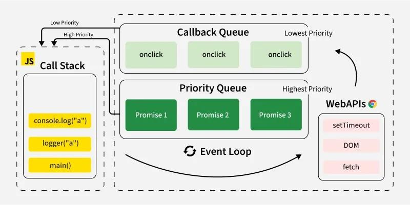

# JavaScript Event Loop 

<div align="center">

### 🚀 Master the JavaScript Event Loop | Step-by-Step Visual Journey

[](https://developer.mozilla.org/en-US/docs/Web/JavaScript)
[](https://nodejs.org/)

**From Zero to Hero: Build Mind-Blowing Understanding of JavaScript's Secret Engine**

</div>

---

### 🎯 Welcome! Let's Start This Journey
**“Hello everyone! 
Today, I’m going to teach you something magical inside JavaScript.
Something that makes your websites fast… smooth… and super responsive.
Something that every frontend or backend developer must understand deeply.
Yes… today we are going to learn the Event Loop — the secret engine inside JavaScript!


Are you ready? Let's begin! 👇

---

##  🌟  Meet the Event Loop: The Heartbeat of JavaScript
**What is javascript.!**
**JavaScript is one of the most powerful languages today in the word .**
**JavaScript is a synchronous, single-threaded programming language, which means it can execute only one command at a time and in a specific order (line by line)**

It runs inside every browser, handles:
- ✨ User interactions (clicks, scrolls)
- 🎨 Animations
- ⏰ Timers
- 🌐 Network calls (fetching data)
- 📦 And much, much more...

### But here's the twist... 🤔

👉 **JavaScript can do only ONE thing at a time!**

Yes, you heard that right. JavaScript has only **one thread**.

So the question is:

> **"If JavaScript can do only one thing at a time,  
> how does it handle SO MANY things without freezing?"**
>**That's the magic of the Event Loop** ⚡


---

## 🌟 JavaScript is Single-Threaded
---
Let me explain with a fun example:

Imagine JavaScript is **one person** working inside a kitchen..  
This person can:
- 🥘 Prepare one dish at a time
- 📖 Read one recipe at a time
- 🔥 Cook one item at a time
-  No multitasking.
This is called **Single-Threaded Execution**.

### Let's See It In Action! 👀
```javascript
console.log("One!");
console.log("Two!");

function logThree() {
console.log("Three!");
}

function logThreeAndFour() {
logThree();
console.log("Four!");
}

logThreeAndFour();


**Output:**
One!
Two!
Three!
Four!

```


**This works smoothly because everything is simple and fast.
But the real problem starts when JavaScript faces a slow task.**


---


---


## 🌟The Problem - What If Something Takes Time?(Slow Tasks)
---
**What if JavaScript gets a huge loop?
Or a network request waiting for 5 seconds?
Should JavaScript sit and wait?
If it waits → your whole website freezes!**

**You can’t click… you can’t scroll…
The browser feels broken**

### Let's See It In Action! 👀


This is called **"Blocking"** - and it's **BAD**!


So we need a different system. A system that allows JavaScript to **continue working** while slow tasks are handled **somewhere else**.

**So JavaScript needed help…**
---

But where? 👇
---
🌟 The Secret Helpers Behind JavaScript: Web APIs
---
**And here comes the twist!**
**JavaScript is not alone!**

It lives inside the **browser**. And the browser gives JavaScript **superpowers** 🦸

These superpowers are called **Web APIs**:

🌐 **setTimeout** - Set timers  
🌐 **setInterval** - Repeat tasks  
🌐 **fetch** - Get data from servers  
🌐 **DOM events** - Handle clicks, scrolls  
🌐 **localStorage** - Store data  
🌐 **Geolocation** - Get user location  


### Here's The Brilliant Part:

Whenever JavaScript finds a slow task, it does something very **clever**:

1️⃣ **It gives the slow task to the browser** (Web APIs)  
2️⃣ **Continues running other code**  
3️⃣ **Browser completes the task and notifies JavaScript later**  


**This is what makes JavaScript fast and non-blocking!** 🚀

---

 🌟  Call Stack: The Heart of JavaScript
---

The **Call Stack** is where JavaScript actually **executes code**.

 Think of it like a **stack of plates** 🍽️:
- When a function is called → it's placed **on top**
- When a function  finished → it's **removed**
- JavaScript always works on the **topmost plate**
- JavaScript always works on the top plate.

If something heavy sits on top → everything behind it stops.**
---------------------------------------------------------


---
 🌟 Web APIs: Handling Slow Work for JavaScript
---------------------------------------------------------
**When JavaScript sees this:**
```javascript
setTimeout(() => {
  console.log("Hey!");
}, 3000);
```

**JavaScript says — ‘Bro, I’m not waiting! I have more work to do.’
It sends the timer to the browser.**

**After 3 seconds, the browser says:
→ Timer is done, here is your callback.**

**But this callback cannot interrupt JavaScript.
  It must wait somewhere…”**

---
🌟 The Callback Queue (Task Queue)
---------------------------------------------------------
**This waiting area is called the Callback Queue.
  Here we place tasks from:**

- ⏰ setTimeout
- 🔁 setInterval
- 🖱️ Click events

It puts their **callbacks** into a waiting area called:

🟥 **Callback Queue** (also called **Macrotask Queue** or **Task Queue**)

These tasks wait patiently for their turn.


But there's another queue that's even **more important**! 👇

  ### The VIP Queue - Microtask Queue

---
**Some callbacks are more important.
  They get VIP entry.**

🟩 **Promise.then()**  
🟩 **async/await**  
🟩 **queueMicrotask()**  

These go into a **VIP queue** called:

🟩 **Microtask Queue**

JavaScript **ALWAYS** clears this queue **first** because microtasks have **highest priority**!


---
🧪 CODE EXAMPLE — Microtasks Queue vs  Task Queue (Callback Queue)
---

```javascript
console.log("Start");

setTimeout(() => console.log("Timeout"), 0);

Promise.resolve().then(() => console.log("Promise"));

console.log("End");
```

Output:
```
Start
End
Promise
Timeout
```

✔ Promise → Microtask (VIP)
✔ Timeout → Macrotask (Normal)

**Promise wins because microtasks are VIP.**

---
 🌟  The Event Loop
---------------------------------------------------------
Now comes the **hero** of the story:

### 🎯 The Event Loop

The **Event Loop** is the **brain** that decides **when things should happen**.

If the Call Stack is the **heart**, then the Event Loop is the **brain**   

**Here's how it works:**

### 🧠 Step 1: Event Loop Watches the Call Stack

It keeps asking:  
> "Is JavaScript busy right now, or is it free?"

If the Call Stack is busy, the Event Loop **waits**.

### 🧠 Step 2: When JavaScript Becomes Free...

The Event Loop says:  
> "Before anything else, let me finish all the **microtasks** (Promises). These are VIP tasks!"

It runs **every single Promise callback**, one after another, until the microtask queue is **completely empty**.

This is why **Promises run earlier than timeouts**! 🚀

### 🧠 Step 3: After Microtasks, It Runs ONE Macrotask

When the microtask queue is empty, the Event Loop turns to the **Task Queue** and says:  
> "Okay, now I can take **one normal callback**, like setTimeout or a click event."

It will take **only one macrotask** at a time, run it completely, and then **repeat** the whole process again.

### 🧠 Step 4: This Cycle Repeats Forever

This checking, deciding, and executing happens so fast that it seems **magical** ✨

But it's just the Event Loop doing its job **perfectly**!

This is what keeps JavaScript:
- 💨 Smooth
- ⚡ Fast
- 📱 Responsive
- 🚫 Non-blocking
- 🎯 Able to manage multiple tasks

...even though it has **only one thread**!

---
 🌟 Why Promise Chains Run Faster
---
```javascript
Promise.resolve()
  .then(() => console.log("C"))
  .then(() => console.log("D"));
```

Both C and D go into the microtask queue.
This means they run before any timer callback.
This is why:
```
A
E
C
D
B
```

makes total sense.

---
🌟 Why setTimeout(0) Is NOT Instant
---
**Some students ask:
  Sir, if I write setTimeout with 0 milliseconds, why doesn’t it run immediately?’**
  A timer with 0ms still goes to the callback queue.
  So it must wait for:
✔ The call stack to empty
✔ Microtasks to complete
This is why it feels slower than expected.

---
 🌟  Final Summary (Crystal Clear)
---------------------------------------------------------
**Let’s summarize everything in one shot:**
✔ JavaScript is single-threaded
✔ Browser does heavy work
✔ Microtasks (Promises) have highest priority
✔ Event Loop manages everything
✔ JavaScript becomes super fast because of delegation

This is how JavaScript handles thousands of tasks without freezing!”**




> **Complete Architecture:** This comprehensive diagram shows all components working together - Call Stack (yellow), Callback Queue (green onclick), Priority Queue (green Promises), WebAPIs (pink), and the Event Loop connecting everything. Notice how Promises have "Highest Priority"!

---
🌟  Final Practice Code
---------------------------------------------------------
```javascript
console.log(1);

setTimeout(() => console.log(2), 1000);

Promise.resolve().then(() => console.log(3));

console.log(4);
```

Ask your students:
👉 What will be the output?
Correct answer:
```
1
4
3
2
```

---

***Congratulations Dear Students!
Now you understand one of the most powerful and magical concepts in JavaScript — the Event Loop.
If you understand this, you are already better than 70% of developers.
Keep practicing, keep experimenting — and keep coding! Thanks you so much” 🚀💛***

---
